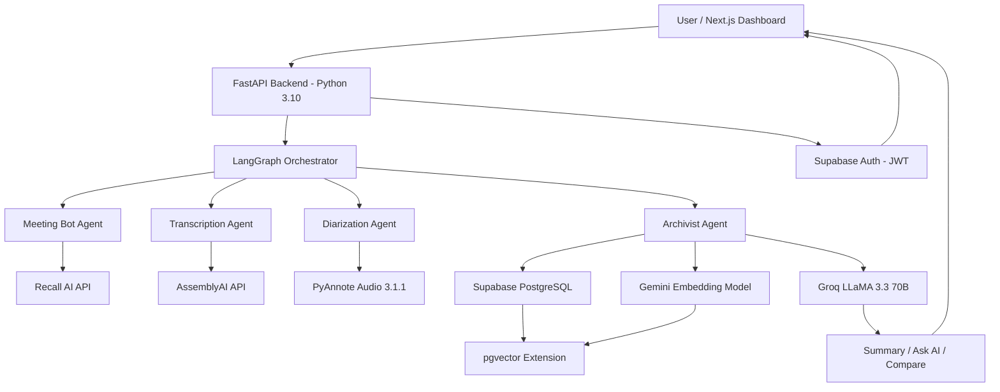

# 🎙️ BOARDROOM AGENT
### AI-Powered Meeting Intelligence System using LangGraph


An **AI-powered multi-agent meeting intelligence platform** that automatically joins live meetings, transcribes multilingual audio, identifies speakers, generates AI summaries, and enables intelligent querying across meeting history using Retrieval-Augmented Generation (RAG).

---

## 🚀 Features

### 🤖 Automated Meeting Bot
- Auto-joins Google Meet, Zoom, and Microsoft Teams via Recall AI
- Records full meeting audio without manual intervention
- Real-time bot status tracking (Joining → Live → Completed)
- Supports multiple meeting platforms from a single dashboard

### 🎤 Multilingual Transcription & Diarization
- Speech-to-text using AssemblyAI with multilingual support
- Supports Tamil, Hindi, English, and code-switched conversations
- Speaker diarization using PyAnnote Audio 3.1.1
- Timestamp overlap matching for accurate speaker attribution
- Per-segment confidence scores and language detection

### 🧠 AI-Powered Intelligence (Groq LLaMA 3.3 70B)
- Structured meeting summaries with Key Points, Decisions, Action Items
- RAG-based Ask AI — query across all past meetings naturally
- Cross-meeting comparison with Similarities, Differences, Progress sections
- Smart query routing — RAG for normal queries, full transcript for comparisons
- Multilingual responses matching the detected transcript language

### 📦 RAG System (Retrieval-Augmented Generation)
- 768-dimensional vector embeddings via Gemini Embedding model
- pgvector cosine similarity search on Supabase PostgreSQL
- Top-K semantic retrieval for grounded, hallucination-free answers
- Comparison intent detection bypassing RAG for full context

### 📊 Meeting History & Export
- All meetings linked to authenticated user accounts
- Meeting history modal with title and date per meeting
- One-click PDF transcript download via browser print dialog
- Session persistence across page refreshes via localStorage

### 🔐 Authentication & Security
- Supabase Auth with email and password login
- JWT token-based secure API communication
- User-scoped meeting data — no cross-user data leakage
- CORS protection on FastAPI backend

---

## 🏗️ Architecture



---

## 🧩 Multi-Agent Architecture

| Agent | Responsibility | Technology |
|---|---|---|
| **Meeting Bot Agent** | Join meeting and record audio | Recall AI API |
| **Transcription Agent** | Multilingual speech-to-text | AssemblyAI |
| **Diarization Agent** | Speaker identification and labeling | PyAnnote 3.1.1 + PyTorch |
| **Archivist Agent** | Storage, embeddings, RAG retrieval | Gemini + Supabase pgvector |
| **Analysis Agent** | Summary, Q&A, Comparison | Groq LLaMA 3.3 70B |

---

## 🗂️ Project Structure

```
boardroom-agent/
├── backend/
│   ├── api/
│   │   └── routes/
│   │       ├── auth.py           # Login, signup endpoints
│   │       ├── recall.py         # Meeting bot management
│   │       ├── archive.py        # Store, summary, ask, history
│   │       └── meetings.py       # Meeting management
│   ├── agents/
│   │   └── archivist.py          # RAG, summary, comparison logic
│   ├── services/
│   │   ├── assembly_service.py   # AssemblyAI transcription
│   │   ├── diarization_service.py# PyAnnote diarization
│   │   └── recall_service.py     # Recall AI bot management
│   ├── utils/
│   │   └── config.py             # Settings and environment variables
│   └── main.py                   # FastAPI app entry point
│
├── frontend/
│   └── src/
│       └── app/
│           ├── dashboard/
│           │   └── page.tsx      # Main dashboard UI
│           ├── auth/
│           │   └── login/
│           │       └── page.tsx  # Login page
│           └── history/
│               └── page.tsx      # Meeting history page
│
└── README.md
```

---

## ⚙️ Tech Stack

### Backend
| Technology | Version | Purpose |
|---|---|---|
| Python | 3.10 | Core backend language |
| FastAPI | 0.110+ | REST API framework |
| Uvicorn | Latest | ASGI server |
| LangGraph | Latest | Multi-agent orchestration |
| PyAnnote Audio | 3.1.1 | Speaker diarization |
| PyTorch | 2.3.0 | ML inference backend |
| ffmpeg | Latest | Audio conversion to WAV |

### AI Services
| Service | Purpose |
|---|---|
| Recall AI | Meeting bot deployment |
| AssemblyAI | Multilingual transcription |
| Groq LLaMA 3.3 70B | Text generation, summary, Q&A |
| Gemini Embedding (gemini-embedding-2-preview) | 768-dim vector embeddings |

### Database & Auth
| Technology | Purpose |
|---|---|
| Supabase PostgreSQL | Structured data storage |
| pgvector | Vector similarity search for RAG |
| Supabase Auth | JWT-based user authentication |

### Frontend
| Technology | Version | Purpose |
|---|---|---|
| Next.js | 14 | React framework |
| TypeScript | 5.0 | Type-safe development |
| Tailwind CSS | 3.x | Utility-first styling |

---

## 🛠️ Installation & Setup

### Prerequisites
- Python 3.10
- Node.js 18+
- ffmpeg installed on system
- Supabase account
- API keys for: Recall AI, AssemblyAI, Groq, Gemini, HuggingFace

### 1. Clone the Repository
```bash
git clone https://github.com/your-username/boardroom-agent.git
cd boardroom-agent
```

### 2. Backend Setup
```bash
cd backend

# Create virtual environment
python -m venv venv310
venv310\Scripts\activate   # Windows
source venv310/bin/activate # Linux/Mac

# Install dependencies
pip install -r requirements.txt
```

### 3. Environment Variables
Create a `.env` file in the `backend/` directory:
```env
# Supabase
SUPABASE_URL=your_supabase_url
SUPABASE_KEY=your_supabase_anon_key

# AI Services
GEMINI_API_KEY=your_gemini_api_key
GROQ_API_KEY=your_groq_api_key
ASSEMBLYAI_API_KEY=your_assemblyai_api_key
HUGGINGFACE_TOKEN=your_huggingface_token
RECALL_API_KEY=your_recall_api_key
RECALL_WEBHOOK_URL=your_webhook_url
```

## 📦 Key Python Dependencies

```txt
fastapi
uvicorn
pyannote.audio==3.1.1
torch==2.3.0
torchaudio==2.3.0
numpy==1.26.4
torchmetrics==1.4.0
speechbrain==1.0.3
setuptools==69.5.1
lightning==2.3.0
google-genai
groq
supabase
assemblyai
python-dotenv
pydantic-settings
```

---

## 🔌 API Endpoints

### Authentication
| Method | Endpoint | Description |
|---|---|---|
| POST | `/api/auth/login` | Login and get JWT token |
| POST | `/api/auth/signup` | Register new user |

### Meeting Bot
| Method | Endpoint | Description |
|---|---|---|
| POST | `/api/recall/join` | Dispatch bot to meeting |
| GET | `/api/recall/transcript/{bot_id}` | Fetch and process transcript |

### Archive & AI
| Method | Endpoint | Description |
|---|---|---|
| POST | `/api/archive/store` | Store transcript + generate embeddings |
| GET | `/api/archive/summary/{bot_id}` | Generate AI meeting summary |
| POST | `/api/archive/ask` | Ask AI about meetings (RAG) |
| GET | `/api/archive/compare` | Compare two meetings |
| GET | `/api/archive/user/meetings` | Get user's meeting history |
| GET | `/api/archive/meetings/{id}/transcript` | Get transcript for PDF export |

---

## 📊 Performance

### Word Error Rate (WER) Evaluation

| Model | WER Score | Accuracy |
|---|---|---|
| **Boardroom Agent** | **0.41** | **~59%** ✅ |
| Baseline (OtterAI) | 0.68 | ~32% ❌ |

> Boardroom Agent achieves **39.7% improvement** over the baseline through AssemblyAI multilingual transcription + PyAnnote diarization pipeline.

**WER Formula:**
```
WER = (S + D + I) / N
S = Substitutions | D = Deletions | I = Insertions | N = Total Reference Words
```

---

## 🔄 How It Works

```
1. User submits meeting link
        ↓
2. Recall AI bot joins the meeting and records audio
        ↓
3. Audio downloaded and converted to 16kHz mono WAV (ffmpeg)
        ↓
4. AssemblyAI → multilingual transcript with timestamps
   PyAnnote   → speaker segments with timestamps (parallel)
        ↓
5. Timestamp overlap matching → speaker-labeled transcript
        ↓
6. Supabase → store transcript segments
   Gemini   → generate 768-dim embeddings → pgvector
        ↓
7. User asks question
        ↓
8a. Comparison query? → fetch full transcripts of latest 2 meetings
8b. Normal query?     → pgvector cosine similarity search (top-10)
        ↓
9. Groq LLaMA 3.3 70B → generate grounded answer
        ↓
10. Response displayed on dashboard
```

---

## 🗄️ Database Schema

```
meetings
├── id (UUID, PK)
├── title (VARCHAR)
├── user_id (UUID → auth.users)
├── created_at (TIMESTAMP)
├── meeting_url (TEXT)
└── status (VARCHAR)

transcripts
├── id (UUID, PK)
├── meeting_id (UUID → meetings)
├── speaker (TEXT)
├── text (TEXT)
├── timestamp (TEXT)
├── confidence (FLOAT)
└── language (TEXT)

transcript_embeddings
├── id (UUID, PK)
├── meeting_id (UUID → meetings)
├── meeting_date (TIMESTAMP)
├── speaker (TEXT)
├── text (TEXT)
└── embedding (vector(768))
```

---

## 🔮 Future Enhancements

- [ ] Real-time live transcription during meetings
- [ ] Dynamic participant count for improved diarization accuracy
- [ ] Sentiment analysis per speaker
- [ ] Calendar integration for auto action item scheduling
- [ ] Analytics dashboard — speaker participation, decision trends
- [ ] Mobile app (Android / iOS)
- [ ] Slack / Jira / Notion integration
- [ ] Blockchain-based transcript verification

---

## 👥 Team

| Name | Role |
|---|---|
| Chaarukesh Abhi CH | Full Stack + AI Integration |
| Balaji N | Backend Development |
| Kishore K | Frontend Development |


---
